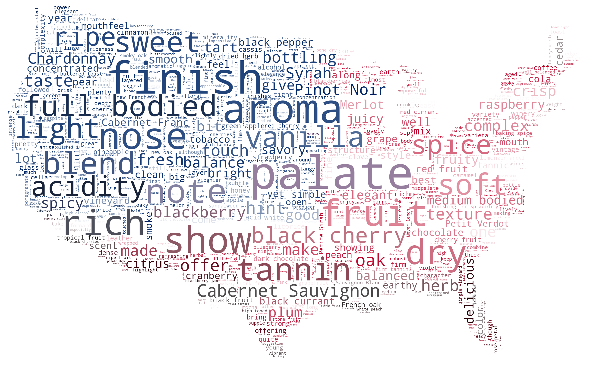
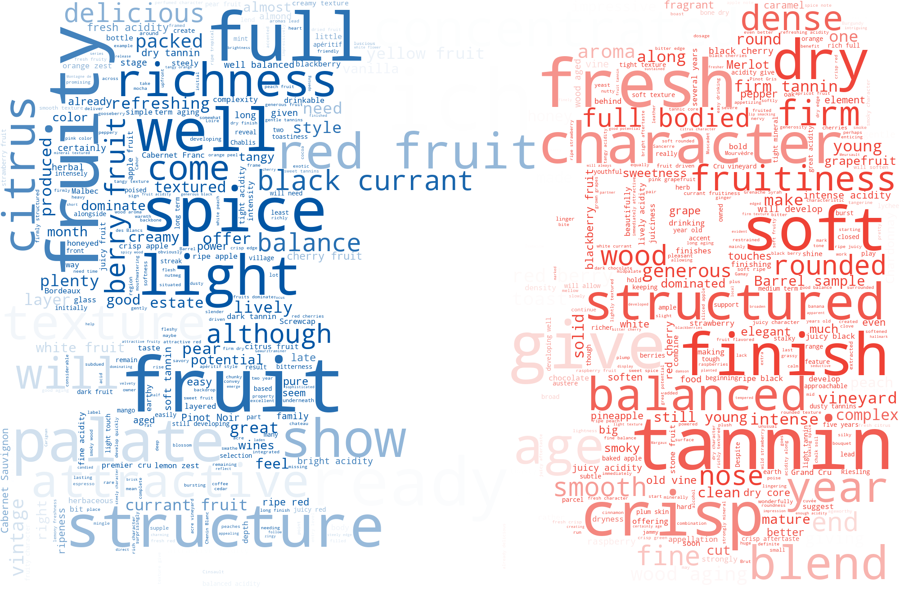
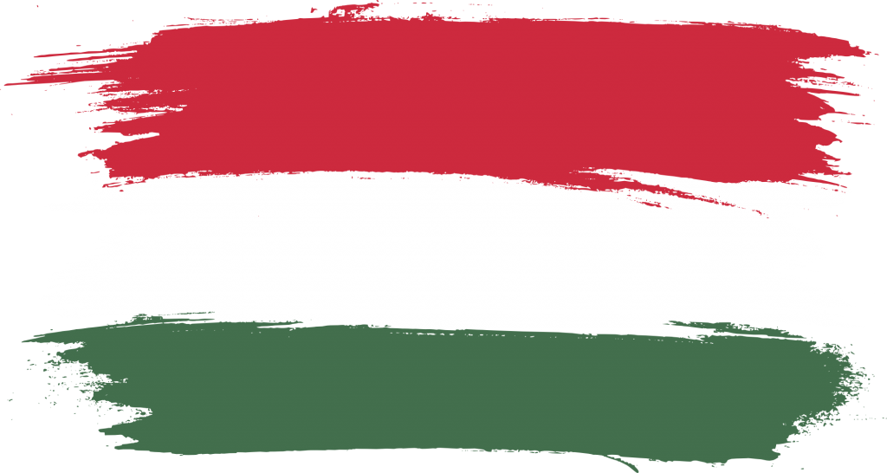
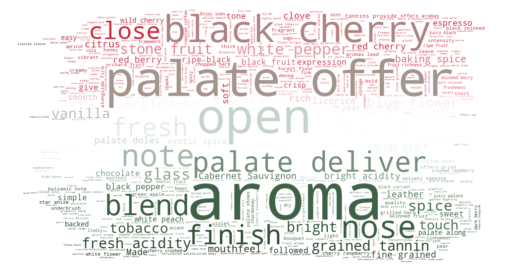
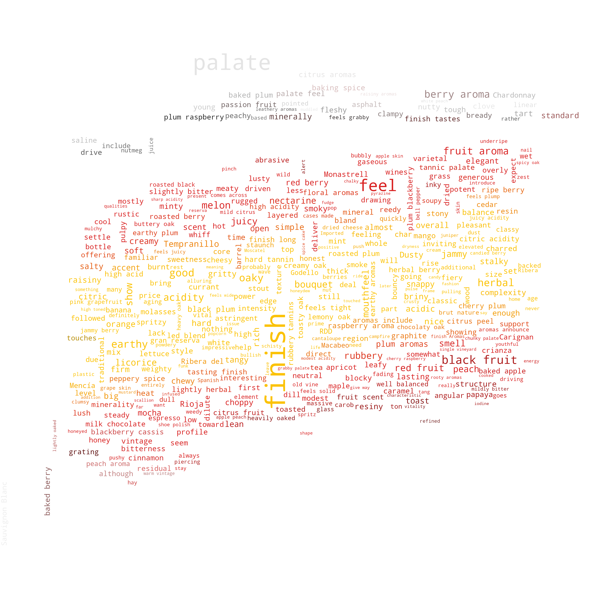
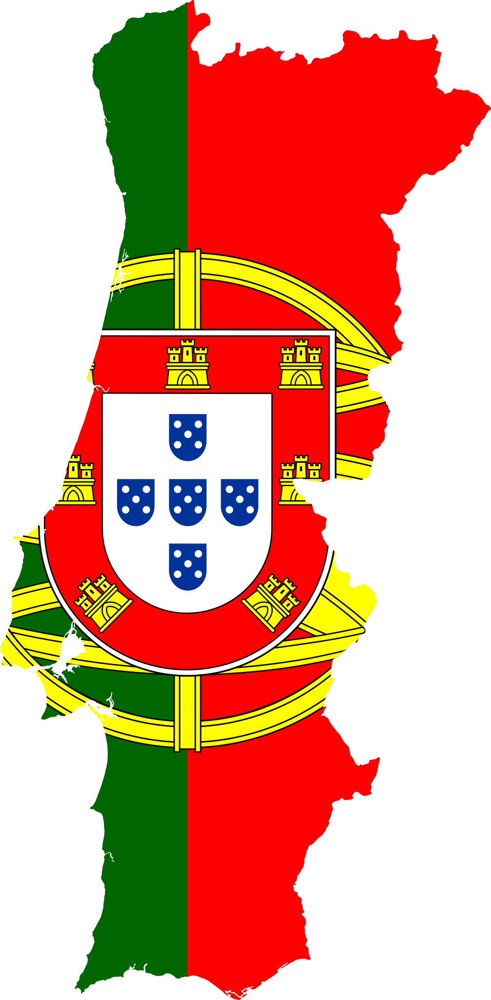
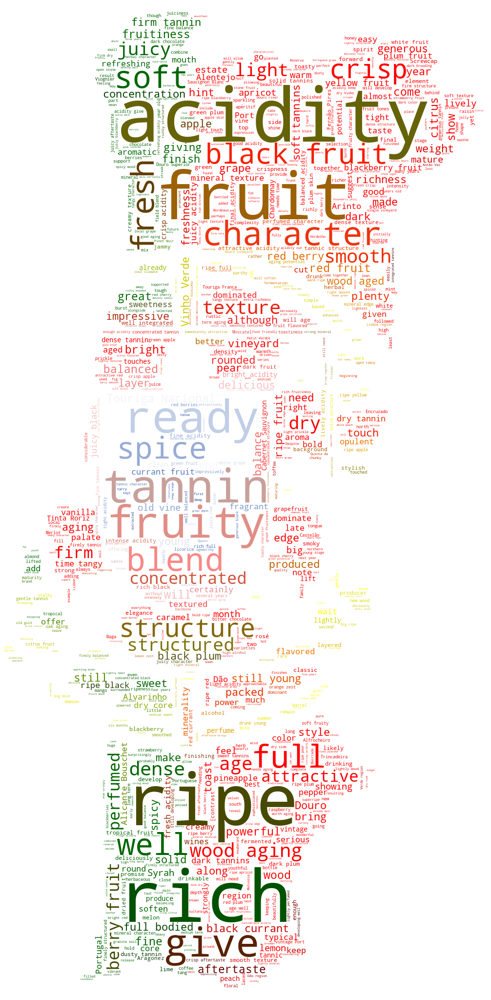

# Generating WordClouds in Python

Learn how to perform Exploratory Data Analysis for Natural Language Processing using WordCloud in Python.

## Description:

In this we will use a wine review dataset taken from Wine Enthusiast website to learn:

 - How to create a basic wordcloud from one to several text documents
 - Adjust color, size and number of text inside your wordcloud
 - Mask your wordcloud into any shape of your choice
 - Mask your wordcloud into any color pattern of your choice

  
   

  
   

  
   

  
   

  
   

## Dataset Content:

This project uses the wine review dataset from Kaggle. This collection is a great dataset for learning with no missing values (which will take time to handle) and a lot of text (wine reviews), categorical, and numerical data.

#### Dataset Link: https://www.kaggle.com/zynicide/wine-reviews

## Prerequisites:

Below libraries are needed to execute this Python code.

 - numpy
 - pandas
 - cv2
 - matplotlib
 - pillow
 - wordcloud

